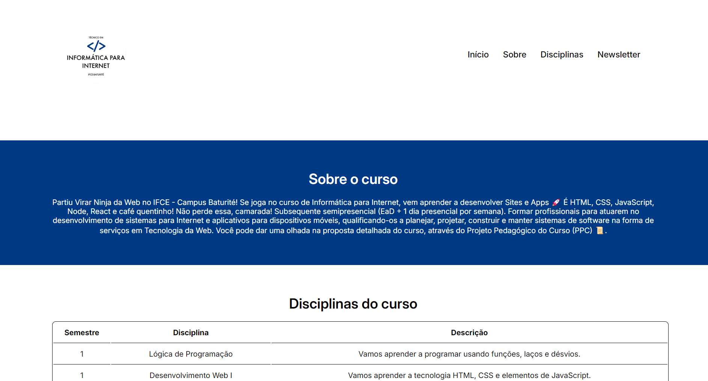

<h1 align="center">
  Avaliação II da Disciplina de Desenvolvimento Web I
</h1>

<ul>
  <li>
    <a href="#sobre-o-projeto">
      Sobre o projeto
    </a>
  </li>
  <li>
    <a href="#tecnologias">
      Tecnologias
    </a>
  </li>
</ul>

## Sobre o projeto

Avaliação II da disciplina de Desenvolvimento Web I que o objetivo era elaborar uma página web sobre um tema de sua preferência (não podia ser o mesmo tema do site desenvolvido ao longo da disciplina). A página devia conter os seguintes itens:

**Arquivo HTML:**

1. Organização com tags semânticas do HTML (header, main, section, article, nav e foorter).
2. Pelo menos uma tabela e uma imagem.
3. Um menu de navegação para outras páginas com no mínimo três links (Os links não precisam apontar para uma página existente).
4. Uma logomarca e um cabeçalho com o nome do site.
5. Uma lista ordenada.
6. Um rodapé com o nome do autor (seu nome).
7. Um formulário de login no topo do site à direita.
8. Deve ser enviado, no espaço da atividade, a página com nome `index.html`.

**Arquivo CSS:**

Para formatação da página HTML crie um arquivo CSS que deve conter as seguintes funcionalidades:

1. Desenvolver um Template para o conteúdo HTML, use flexbox, grid ou ambos.
2. Formatar os itens da página usando propriedades CSS. Ex.: Estilos de fonte, imagem, bordas, links e listas.
3. Deve ser enviado, no espaço da atividade, a página com nome style.css

## Tecnologias

O projeto foi desenvolvido com as seguintes tecnologias:

- [HTML](https://developer.mozilla.org/pt-BR/docs/Web/HTML)
- [CSS](https://developer.mozilla.org/pt-BR/docs/Web/CSS)
