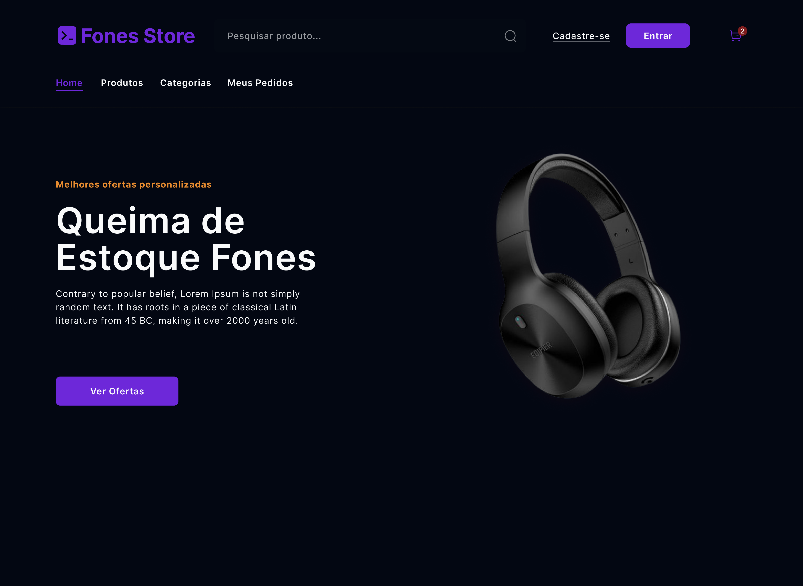
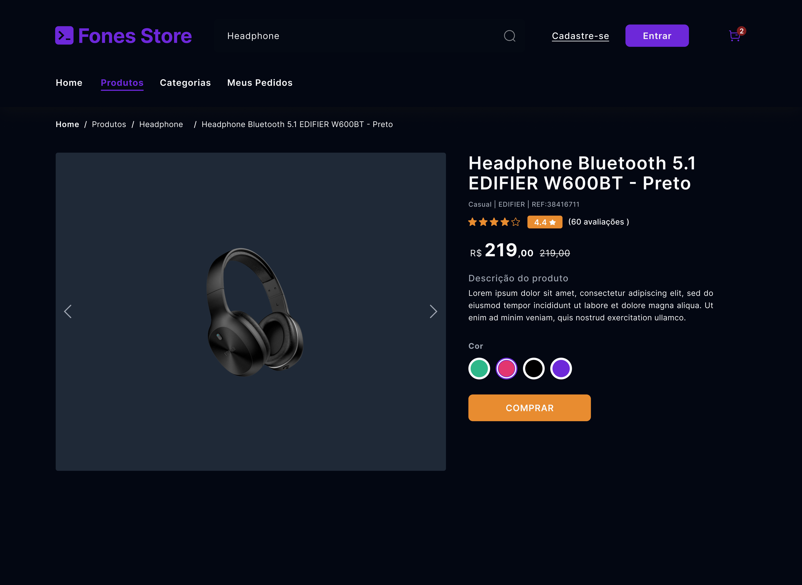

  <strong>
    Instituto Federal de Educação, Ciência e Tecnologia do Ceará (IFCE)  
    Campus Baturité  
    Curso Técnico Subsequente em Informática para Internet
  </strong>

  <strong>
    Atividade da Unidade 1 da Disciplina de Desenvolvimento Web 1
  </strong>

  <strong>
    Baturité-CE  
    2024
  </strong>

  <strong>
    Identificação do Aluno
  </strong>

**Nome:** Pedro Henrique Marinho Euzebio
**Professor(a):** Cintia Reis de Oliveira
**Curso:** Técnico Subsequente em Informática para Internet
**Turma:** 2024.1

**Car@ alun@, escolha um “objeto tema” e realize a criação do layout do site utilizando o Figma [https://www.figma.com/](https://www.figma.com/). O design deve possuir:**

- **Uma página inicial, que deve ter uma coleção do “objeto tema”**
- **Uma página de detalhes do “objeto tema”**
- **Uma página de cadastro do “objeto tema”**

**Com um formulário e uma tabela com a lista de objetos cadastrados. Cada linha da tabela deve ter botões para alterar e apagar o objeto.**

**Respostas:**

Página de Início:

Página de Detalhes do Produto:

Página de Detalhes do Produto:

