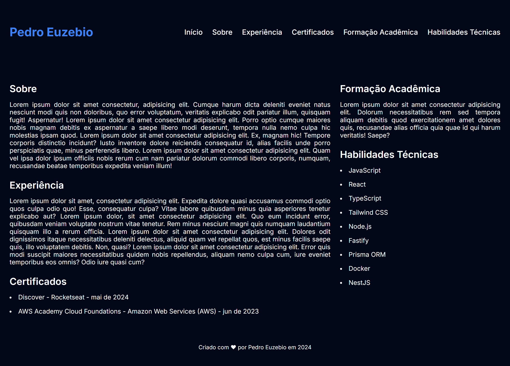

<h1 align="center">
  Atividade
</h1>

## Roteiro

<ul>
  <li>
    <a href="#sobre">
      Sobre
    </a>
  </li>
  <li>
    <a href="#tecnologias">
      Tecnologias
    </a>
  </li>
</ul>

## Sobre

Atividade da Unidade 6 da Disciplina de Desenvolvimento Web 1 do Curso Técnico em Informática do IFCE.

## Tecnologias

A atividade foi desenvolvido com as seguintes tecnologias:

- HTML
- CSS
